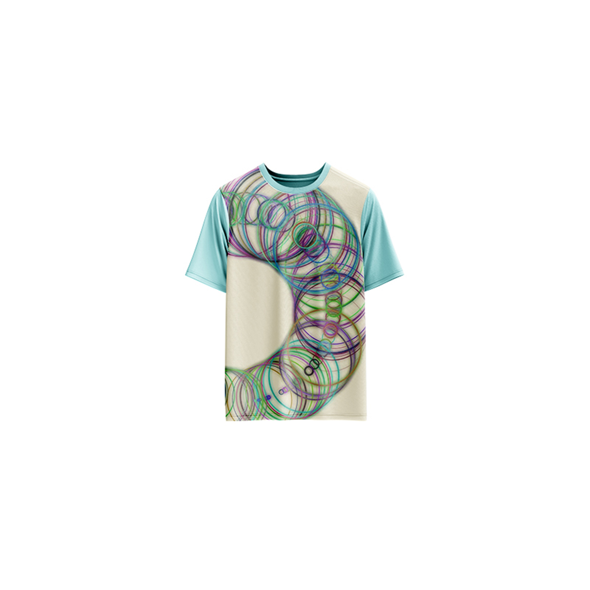

# Twist 1 — Generative Geometric Art

[](https://github.com/reyrove/Twist-1-Generative-Geometric-Art)
[](https://opensource.org/licenses/MIT)

> **Generative art meets apparel design.** Each refresh creates a unique composition of twisting circles with random colors, backgrounds, and seed-based patterns.



## 🎨 Live Demo

**[View it live →](https://github.com/reyrove/Twist-1-Generative-Geometric-Art)**

## ✨ Features

- **Infinite Variations** — 100–500 circles, π–5π twist range, 12 background colors, random RGB strokes
- **Seed-Based** — Every composition is unique and reproducible via its seed
- **Save & Share** — Download as PNG with seed in filename
- **Apparel Mode** — Preview artwork on a T-shirt mockup
- **Responsive** — Works on desktop, tablet, and mobile
- **Keyboard Shortcuts**:
  - `R` — Regenerate
  - `S` — Save image
  - `T` — Toggle apparel view

## 🚀 Quick Start

### Local Development

```bash
# Clone the repository
git clone https://github.com/reyrove/Twist-1-Generative-Geometric-Art.git

# Navigate to the directory
cd twist1

# Open in browser
open index.html
# or use a live server
```

### Deploy to GitHub Pages

1. Push to GitHub
2. Go to Settings → Pages
3. Select branch `main` and root folder
4. Your site will be live at `https://github.com/reyrove/Twist-1-Generative-Geometric-Art`

## 🧠 How It Works

The artwork is generated using a deterministic random number generator, seeded by timestamp + random noise. Every refresh:

1. Chooses a background from 12 predefined colors
2. Generates 100–500 circles (increments of 10)
3. Each circle gets a random position, radius, stroke width, and RGB color
4. The "twist" parameter (π–5π) controls the spread and density

## 📁 File Structure

```
twist1/
├── index.html          # Main application (all-in-one)
├── Twist-1.jpg         # T-shirt mockup image
├── fav.svg             # Favicon
├── README.md           # This file
└── LICENSE             # MIT License
```

## 🛠️ Tech Stack

- **Vanilla HTML/CSS/JS** — No dependencies
- **Canvas API** — 2D rendering
- **CSS Grid & Flexbox** — Responsive layout
- **GitHub Pages** — Hosting

## 📸 Gallery

| Desktop | Mobile | Apparel |
|---------|--------|---------|
| Desktop view | Mobile responsive | T-shirt mockup |

## 🔧 Customization

You can tweak the generation parameters in `index.html`:

- **Circle count range**: Modify `circlenum` calculation (line ~175)
- **Twist range**: Adjust `B` min/max (line ~176)
- **Background colors**: Edit `backgroundColours` array (line ~90)
- **Foreground colors**: Edit `foregroundColours` array (line ~91)

## 📄 License

MIT License — see [LICENSE](LICENSE) file for details.

## 🙏 Acknowledgments

- Designed as generative art for apparel
- Inspired by parametric design and computational creativity

---

**Built with ❤️ and randomness**